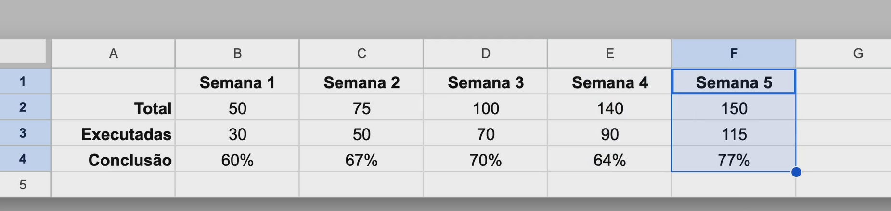
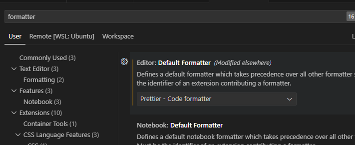
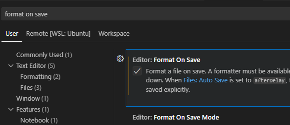
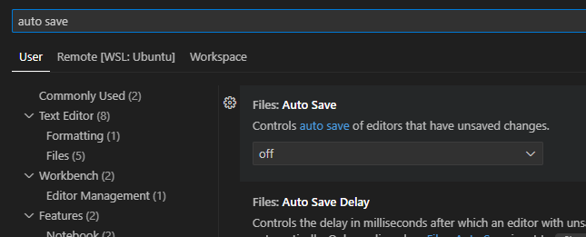
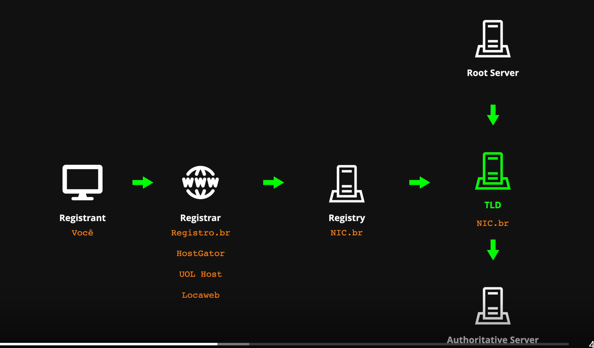
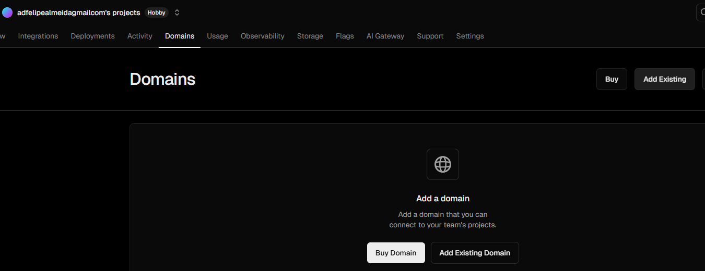
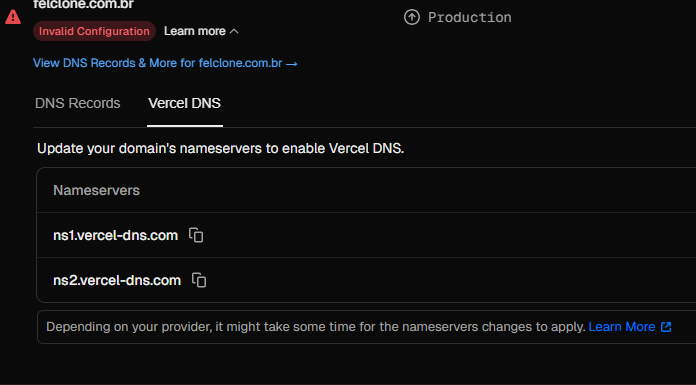
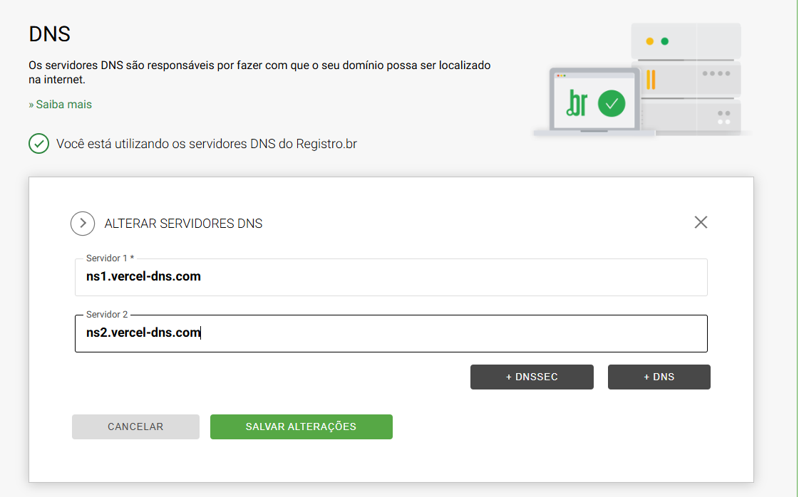

# Clone TabNews

Um projeto de exemplo para aprender Next.js, inspirado no TabNews.

## Como rodar o projeto

1. Instale as dependências:

   ```bash
   npm install
   ```

2. Inicie o servidor de desenvolvimento:

   ```bash
   npm run dev
   ```

3. Acesse [http://localhost:3000](http://localhost:3000) no seu navegador.

## Estrutura inicial

Crie o arquivo `pages/index.js` com o seguinte conteúdo para exibir a página inicial:

```javascript
function Home() {
  return (
    <div>
      <h1>Bem-vindo ao Clone TabNews</h1>
      <p>Este é um projeto de exemplo para aprender Next.js.</p>
    </div>
  );
}

export default Home;
```

Pronto! O servidor estará rodando e você verá a mensagem de boas-vindas na página inicial.

---

## Aula 07: Relação entre Cliente e Servidor

### O que é Cliente e Servidor?

- **Cliente:** Quem faz uma solicitação e espera uma resposta.
- **Servidor:** Quem recebe a solicitação e fornece o serviço ou resposta.

#### Exemplos simples

- **Copo de água:** Se alguém pede um copo de água, essa pessoa é o cliente e quem serve é o servidor. Se você pede para outra pessoa buscar o copo para entregar, nesse momento você vira cliente e quem busca vira servidor.
- **Restaurante:** Você faz o pedido ao garçom (cliente → garçom), o garçom pede para a cozinha (garçom → cozinha), a cozinha prepara e entrega ao garçom, que traz para você.

---

### Deploy com Vercel

Para publicar seu projeto,

## Aula 09: Níveis de Organização de Tarefas

### Níveis de Organização

#### Nível 1: Ser lembrado individualmente

- Se lembrar do que precisa fazer
- Já sabe como e o que precisa ser feito, mas precisa ser lembrado para não fazer outra coisa
- Utiliza ferramentas com menor custo de produção (energia) e menor tempo de aquecimento
- **Exemplo:** Anotar tarefas em um papel e deixá-lo visível na mesa de trabalho

#### Nível 2: Ser lembrado em grupo

- Relembrar toda a equipe do que precisa ser feito
- Não precisa detalhar muito o que precisa ser feito
- **Exemplo:** Quadros de Kanban

#### Nível 3: Expandir conhecimento

- Desenvolver de forma detalhada o que e como algo deve ser feito
- Documentar processos e compartilhar conhecimento
- **Exemplos:** Trello e GitHub

#### Nível 4: Gerar métricas

- Mensurar a produtividade das pessoas que estão trabalhando nas tarefas
- **Exemplo:** Planilhas com informações de tarefas totais, executadas e concluídas
  

### Gerenciamento de Projetos

Ao iniciar um novo projeto, não existem apenas as opções "Tudo" ou "Nada". Há uma abordagem intermediária que envolve dividir o trabalho em partes gerenciáveis.

Um projeto é como uma pedra grande que precisa ser quebrada em partes menores para ser "digerida":

- **Milestones:** São os grandes pedaços da pedra (objetivos maiores)
- **Issues:** São os fragmentos que você consegue consumir (tarefas específicas)

As issues no GitHub são usadas para apontar problemas ou tarefas específicas dentro do repositório.

## Aula 10: Padronização de Código

### EditorConfig

O EditorConfig ajuda a manter estilos de codificação consistentes entre diferentes editores e IDEs.

1. Crie o arquivo `.editorconfig` na raiz do projeto com o seguinte conteúdo:

```
root = true

[*]
indent_style = space
indent_size = 2
```

2. Instale a extensão "EditorConfig for VS Code" para que o editor respeite estas configurações.

### Prettier

O Prettier é uma ferramenta que formata automaticamente seu código para manter um estilo consistente.

1. Instale o Prettier como dependência de desenvolvimento:

```bash
npm install prettier -D
```

2. Adicione os scripts de verificação e correção no `package.json`:

```json
"scripts": {
  "dev": "next dev",
  "lint:check": "prettier --check .",
  "lint:fix": "prettier --write ."
}
```

3. Configure o VS Code:
   - Instale a extensão do Prettier
   - Abra as configurações de Open User Settings (Ctrl + Alt + P)
   - Defina o Prettier como formatador padrão nas configurações:

     

   - Habilite a opção "Format On Save":

     

   - Desabilite o "Auto Save" para ter mais controle sobre quando salvar os arquivos:

     

OBS: O Preetier é para salvar as configurações depoisd e escrever o código, o editorConfig é durante

## Aula 12: Registro de Domínio Próprio

### O que é um registrador de domínio?

- Um registrador de domínio é responsável por registrar e gerenciar domínios na internet.
- No Brasil, o principal registrador é o [registro.br](https://registro.br/).
- Todos os domínios ficam registrados no "Registry", que no Brasil é o nic.br.

  

### Como configurar o DNS na Vercel

1. Acesse o painel da Vercel e entre na seção **Domain**.
2. Clique em **ADD** para adicionar um novo domínio.

   

3. Escolha o projeto e insira o domínio desejado.

   

4. Copie os servidores DNS fornecidos pela Vercel.

   

5. Acesse o site [registro.br](https://registro.br/) e cole os DNSs copiados na configuração do seu domínio.
6. Aguarde a atualização do sistema do registro.br para que o domínio fique ativo.

   

## Aula 14: PoC e MVP

### O que são PoC e MVP?

- **PoC (Prova de Conceito):** Demonstra a viabilidade técnica de uma ideia ou solução. É um experimento para validar se algo é possível antes de investir mais tempo e recursos.
- **MVP (Produto Mínimo Viável):** É a versão mais simples de um produto que já entrega valor ao usuário. O objetivo é lançar rapidamente para obter feedback real e evoluir o produto de forma iterativa.

#### Perguntas para guiar o desenvolvimento

- **Para PoC:**
  - Qual o menor custo que posso ter para mostrar a direção que devo seguir?
  - Qual a prova que confirma (ou não) o conceito que quero validar?

- **Para MVP:**
  - O que é o mínimo que posso fazer, mas muito bem feito, para já resolver o problema do usuário?
  - Qual o menor custo para entregar algo funcional ao usuário?

---

### Milestone 1: Fundação

É interessante começar com uma PoC do front-end, mesmo que simples. O importante é ter uma base inicial para construir e evoluir o projeto.

### "Overengineering"

Evite complicar demais o projeto desde o início. Foque no essencial e vá adicionando complexidade conforme necessário. O objetivo é entregar algo funcional rapidamente, sem se perder em detalhes desnecessários.

Fazer o simples bem feito é mais importante do que fazer algo complexo e cheio de recursos que não são necessários no momento.

## Aula 13: Testes automatizados

O nosso Teste Runner (framework de testes) é o Jest, instalamos ele como dependência de desenvolvimento:

```bash
npm install jest -D
```

Agora adicionar os scripts de teste no `package.json`:

```json
"scripts": {
  "test": "jest",
  "test:watch": "jest --watch"
}
```

É assim que se espera que os testes sejam executados, com "expect" e "toBe" para verificar os resultados.


```javascript
test("soma de dois números", () => {
  expect(valorDinamico).toBe("12");
});
```

Aqui nesse exemplo, o "expect" espera um valor dinâmico, enquanto o "toBe" espera um valor estático. O Jest vai comparar o resultado da soma com o valor esperado.

Pode-se ler assim: Espera-se que algo vindo do sistema (expect, valor dinâmico) possua o resultado declarado (toBe, hardcoded).

## Aula 16: Testes

### Tipos de Testes

- **Teste Unitário:** Testa uma unidade específica do código, como uma função ou método isolado. Não depende de outras partes do sistema ou de infraestrutura externa (ex: banco de dados). São independentes e autossuficientes.
- **Teste de Integração:** Testa a interação entre diferentes partes do sistema, como módulos ou componentes. Garante que as unidades funcionam bem juntas e podem envolver dependências externas, como banco de dados ou APIs.
- **Teste E2E (End-to-End):** Testa o sistema como um todo, simulando o comportamento do usuário final e verificando se todas as partes funcionam juntas corretamente.


### Por que precisamos de testes?

Garantir que as "peças do quebra-cabeça" do software se encaixem é fundamental. Não adianta cada parte funcionar sozinha se, juntas, não entregam o resultado esperado. Mudanças em uma parte do sistema podem causar erros em cadeia. Testes de unidade e integração ajudam a evitar esses problemas ao garantir que alterações não quebrem o funcionamento do sistema.

### Diferença entre tipos de testes

- **Teste de unidade:** Código que funciona por conta própria, sem dependências externas.
- **Teste de integração:** Foca na integração entre unidades ou camadas da aplicação/infrastrutura. Mesmo com 100% de cobertura em testes de unidade, o sistema pode não funcionar se as integrações falharem. Exemplo: testar uma chamada HTTP que acessa um banco de dados.
- **Teste E2E:** O mais fiel ao ambiente real, simulando a experiência do usuário final. Pode envolver deploy em infraestrutura semelhante à produção.

### Velocidade e custos

Quanto mais abrangente o teste, mais lento ele tende a ser. Testes E2E, por exemplo, podem exigir infraestrutura adicional e simulação de navegadores, tornando-os mais demorados. Em projetos grandes, a execução de todos os testes pode impactar o tempo de entrega de correções rápidas (hotfixes).

### Modelos de Testes

- **Pirâmide de Testes:** Proposta por Mike Cohn (2009), sugere ter mais testes unitários, alguns de integração e poucos E2E.
- **Troféu de Testes:** Proposta por Guillermo Rauch (criador do Next.js), valoriza mais os testes de integração.
- **Modelo Favo de Mel do Spotify:** Também dá mais importância aos testes de integração.

### Como distinguir testes de unidade e integração

Antigamente, testes de unidade eram feitos por desenvolvedores e testes de integração pelo time de qualidade. Hoje, muitos defendem que o importante é ter testes rápidos e confiáveis, independentemente da divisão clássica. Se não for possível implementar todos os tipos, priorize os testes de integração, pois eles garantem que as partes do sistema funcionam juntas.

> **Dica:** Projetos como Pagar.me e TabNews priorizaram testes de integração para garantir que a API funcionasse corretamente, já que o mais importante era a integração das partes.

---

### Encostando a mão no Protocolo HTTP

**Endpoint** é o endereço de uma API. Tudo com o que você interage provavelmente é uma interface, que abstrai detalhes de implementação.

Para criar um endpoint no Next.js, crie um arquivo em `pages/api`. Exemplo de rota: `http://localhost:3000/api/status`.


```javascript
function status(request, response) {
  response.status(200).json({ status: "ok" });
}

export default status;
```

**CURL** é uma ferramenta de linha de comando para fazer requisições HTTP.

```bash
curl -v http://localhost:3000/api/status
```


Para visualizar detalhes do protocolo HTTP, utilize o parâmetro `-v`:

```bash
curl -v http://localhost:3000/api/status
```


## Aula 17: Qual banco de dados escolher?

Existem três decisões principais na hora de escolher a arquitetura de dados para um projeto:

- SGBD (Sistema de Gerenciamento de Banco de Dados): software que armazena e gerencia os dados. Exemplos: PostgreSQL, MySQL, MongoDB.
- Biblioteca de acesso / ORM: abstração para fazer queries e mapear modelos no código. Exemplos: Prisma, Sequelize, TypeORM.
- Migrations: scripts que versionam o esquema do banco (criação/alteração de tabelas). Exemplos: Prisma Migrate, TypeORM Migrations.


As escolhas do Filipe para este curso estão ilustradas abaixo:


### Por que o Docker virou padrão?

Antes cada desenvolvedor rodava tudo na própria máquina, o que gerava a famosa frase "na minha máquina funciona". Máquinas virtuais resolveram parte do problema, mas são pesadas.

O Docker trouxe containers leves que compartilham o kernel do sistema operacional, permitindo ambientes isolados, reprodutíveis e mais rápidos. Isso facilita desenvolver, testar e distribuir imagens (ex.: enviar para o Docker Hub).


### Subir um banco de dados local (exemplo: PostgreSQL)

Crie um arquivo de composição na raiz do projeto (ex.: docker-compose.yml) e adicione um serviço de banco:

```yaml
# docker-compose.yml
version: "3.9"

services:
  database:
    image: postgres:17.6-alpine3.21
    environment:
      POSTGRES_PASSWORD: local_password
    ports:
      - "5432:5432"
```

Suba o container em segundo plano:

```bash
docker compose up -d
```

### Conectando ao PostgreSQL local

Instale o cliente psql (Ubuntu/Debian):

```bash
sudo apt update
sudo apt install -y postgresql-client
```

Conecte-se ao banco:

```bash
psql --host=localhost --port=5432 --username=postgres --dbname=postgres
# será solicitada a senha definida em POSTGRES_PASSWORD (ex: local_password)
```

Para sair do psql, digite:

```bash
\q
```

Se o arquivo docker-compose.yml estiver em outro diretório, use:

```bash
docker compose -f caminho/para/docker-compose.yml up -d
```

## Aula 18: Criar módulo "database.js"

No terminal usamos o psql para conectar ao PostgreSQL manualmente. No código, usamos o pacote "pg" para conectar ao banco a partir da aplicação.


Instalação do pacote "pg":

```bash
npm install pg@8.11.3
```

Então dentro do diretório infra, foi criado o modulo database.js, que é responsável por de baixo dos panos, abrir conexão
com o banco de dados, executar uma query e fechar a conexão., sem que seja preciso fazer isso em cada arquivo, somente importando ele

```javascript
import { Client } from "pg";

async function query(queryObject) {
  const client = new Client({
    host: "localhost",
    port: 5432,
    user: "postgres",
    database: "postgres",
    password: "local_password",
  });

  await client.connect();
  const result = await client.query(queryObject);
  await client.end();

  return result;
}

export default { query };
```

Então importamos esse modulo database para dentro do nosso endpoint /api/v1/status, e fazemos uma query de teste, que é o SELECT 1 + 1 AS sum.

```javascript
import database from "../../../../infra/database.js";

async function status(request, response) {
  const result = await database.query("SELECT 1 + 1 AS sum;");
  console.log(result);
  response.status(200).json({ status: "ok" });
}

export default status;
```

### A importância das Variáveis de Ambiente

Podemos definir um serviço em três Camadas:

- Interface
- Aplicação
- Persistência

Enquanto a camada de Interface se preocupa com oferecer o melhor layout e experiência para o usuário, a camada de Aplicação se preocupa com a lógica de negócio e regras do sistema. Já a camada de Persistência é responsável por armazenar os dados de forma segura e eficiente.

A lógica para um serviço ser Stateless (sem estado) é que ele não deve depender de informações armazenadas localmente, como em memória ou arquivos. Isso permite que o serviço seja escalável e resiliente, já que qualquer instância do serviço pode atender a qualquer requisição sem depender de dados específicos.


### Variáveis de Ambiente no Código

Criei o arquivo `.env` na raiz do projeto com as seguintes variáveis:

```
POSTGRES_HOST=localhost
POSTGRES_PORT=5432
POSTGRES_USER=postgres
POSTGRES_DB=postgres
POSTGRES_PASSWORD=local_password
```

E alterei no database.js para pegar essas variáveis de ambiente:

```javascript
const client = new Client({
  host: process.env.POSTGRES_HOST,
  port: process.env.POSTGRES_PORT,
  user: process.env.POSTGRES_USER,
  database: process.env.POSTGRES_DB,
  password: process.env.POSTGRES_PASSWORD,
});
```

### Variáveis de Ambiente no Docker Compose

Foi alterado o docker-compose.yml para pegar as variáveis de ambiente do arquivo .env
foi alterado o environment para env_file

```yaml
version: "3.9"
services:
  database:
    image: postgres:17.6-alpine3.21
    env_file:
      - ../.env
    ports:
      - "5432:5432"
```

### Foi certo fazer o commit do .env?

Segundo a documentação do NextJS sim, .env deveria ser commitado por conter as variáveis de ambiente, porém como pode haver
dados sensíveis, o ideal é ter um .env.example que não contenha dados sensíveis, e sim apenas o nome das variáveis, para que
quem for clonar o projeto, saiba quais variáveis de ambiente precisa criar.

Porém nesse exemplo utilizamos o .env.development, que é específico para o ambiente de desenvolvimento, e não contém dados sensíveis.

```bash
mv .env .env.development
```

E no composer.yaml alterei para pegar o .env.development

```yaml
# Qualquer serviço que você deseja executar deve ser definido aqui.
services:
  database:
    image: "postgres:17.6-alpine3.21"
    env_file:
      - ../.env.development
    ports:
      - "5432:5432"
```

### Caminho Absoluto

Para que o NextJs reconheça o caminho absoluto, foi criado o arquivo jsconfig.json na raiz do projeto com o seguinte conteúdo:

```json
{
  "compilerOptions": {
    "baseUrl": "."
  }
}
```

Esse "." é para referenciar que o caminho absoluto é a raiz do projeto.

Com isso, podemos importar o database.js de forma absoluta, sem precisar usar o caminho relativo com muitos "../"

```javascript
import database from "infra/database.js";
```

### Configurar scripts dos serviços

Primeiro criamos scripts para subir, parar e derrubar o container do docker, fizemos isso dedntro do package.json

```json
{
  "scripts": {
    "services:up": "docker compose -f infra/compose.yaml up -d",
    "services:stop": "docker compose -f infra/compose.yaml stop",
    "services:down": "docker compose -f infra/compose.yaml down"
  }
}
```

Também podemos combinar um comando após o outro, como por exemplo subir o conatiner e já rodar o service com o nosso comando
npm run dev:

```json
{
  "scripts": {
    "dev": "npm run services:up && next dev"
  }
}
```

## Aula 19:

### Endpoint "/status": ISO 8601 + Fuso + MVC + lowerCamelCase

O padrão ISO 8601 é uma norma internacional que define a representação de datas e horas. Ele é amplamente utilizado em APIs para garantir que as informações de data e hora sejam transmitidas de forma consistente e sem ambiguidade.

Um exemplo de data no formato ISO 8601 é: `2023-03-15T13:45:30Z`, que representa 15 de março de 2023, às 13:45:30 UTC.

Além disso, ao trabalhar com fusos horários, é importante considerar a diferença entre UTC e o horário local. O padrão ISO 8601 permite a inclusão de informações de fuso horário, como `2023-03-15T13:45:30-03:00`, que indica que a hora está no fuso horário de Brasília (UTC-3).

Controller pede pro model alguma informação ou regra de negócio

Depois que a Model faz o que tem que ser feito ele retorna essa informação para o Controller.

Então o Controller manda essa informação para a View, que se responsabiliza em devolver isso para o consumidor final no formato correto.

Para fazer a data atual ser retornada no formato ISO 8601, podemos utilizar o método `toISOString()` do objeto `Date` em JavaScript. Esse método retorna uma string no formato ISO 8601, que é o formato desejado para a nossa API.

```javascript
const updatedAt = new Date().toISOString();
```

OBS: a resposta (View) deve sempre ser feita em `snack case`

```javascript
async function status(request, response) {
  const updatedAt = new Date().toISOString();
  response.status(200).json({
    status: "ok",
    updated_at: updatedAt,
  });
}

export default status;
```

## Aula 20

### Database "Version" (+ Red, Green e Refactor do TDD)

RED é o estagio do TDD onde os testes falham, pois a funcionalidade ainda não foi implementada.

GREEN é o estágio onde os testes passam, ou seja, a funcionalidade foi implementada corretamente.

REFACTORY é o estágio de quando os testes já passaram, então podemos refatorar o código deixando ele mais semântico.

Para vermos a versão que esta no Postgres podemos usar a query SHOW, que nos "mostra alguns detalhes da nossa aplicação.

```javascript
async function status(request, response) {
  const updatedAt = new Date().toISOString();
  const databaseVersion = await database
    .query("SHOW server_version;")
    .then((result) => result.rows[0].server_version);

  response.status(200).json({
    updated_at: updatedAt,
    dependences: {
      database: {
        version: databaseVersion,
      },
    },
  });
}
```

Foi preciso fazer o then(), pois o retorno do dabase.query é um array da propriedade row.

```text
Result {
  command: 'SHOW',
  rowCount: null,
  oid: null,
  rows: [ { server_version: '17.6' } ],
  fields: [
    Field {
      name: 'server_version',
      tableID: 0,
      columnID: 0,
      dataTypeID: 25,
      dataTypeSize: -1,
      dataTypeModifier: -1,
      format: 'text'
    }
  ],
  _parsers: [ [Function: noParse] ],
  _types: TypeOverrides {
    _types: {
      getTypeParser: [Function: getTypeParser],
      setTypeParser: [Function: setTypeParser],
      arrayParser: [Object],
      builtins: [Object]
    },
    text: {},
    binary: {}
  },
  RowCtor: null,
  rowAsArray: false,
  _prebuiltEmptyResultObject: { server_version: null }
}
```

### Database "Max Connections"

Podemos pegar a quantidade máxima de conexões que o banco de dados suporta, com a query SHOW max_connections;

```javascript
async function status(request, response) {
  const updatedAt = new Date().toISOString();
  const databaseVersion = await database
    .query("SHOW server_version;")
    .then((result) => result.rows[0].server_version);

  const maxConnections = await database
    .query("SHOW max_connections;")
    .then((result) => result.rows[0].max_connections);

  response.status(200).json({
    updated_at: updatedAt,
    dependences: {
      database: {
        version: databaseVersion,
        max_connections: parseInt(maxConnections),
      },
    },
  });
}

export default status;
```

E fazemos em seguida o teste de integração para esse endpoint /api/v1/status

```javascript
test("Get to /api/v1/status should return 200", async () => {
  const response = await fetch("http://localhost:3000/api/v1/status");
  expect(response.status).toBe(200);

  const responseBody = await response.json();
  expect(responseBody.updated_at).toBeDefined();

  const parsedUpdatedAt = new Date(responseBody.updated_at).toISOString();
  expect(responseBody.updated_at).toBe(parsedUpdatedAt);

  expect(responseBody.dependences.database.version).toEqual("17.6");
  expect(responseBody.dependences.database.max_connections).toEqual(100);
});
```

### Database "Opened Connections"

Criamos a query para pegar a quantidade de conexões abertas no banco de dados, com a query SELECT \* from pg_stat_activity WHERE datname = 'local_db';

```javascript
const databaseOpenedConnectionsResult = await database.query(
  "SELECT count(*)::int from pg_stat_activity WHERE datname = 'local_db';",
);
```

### SQL Injection e Queries Parametrizadas

Primeiro começamos invadindo nosso próprio banco parametrizando nossa query:

```javascript
const databaseName = request.query.databaseName;
const databaseOpenedConnectionsResult = await database.query(
  `SELECT count(*)::int from pg_stat_activity WHERE datname = '${databaseName}';`,
);
```

Então, nos testes de integração, criamos um teste que simula um ataque de SQL Injection:

```javascript
test.only("Teste SQL Injection", async () => {
  await fetch(
    "http://localhost:3000/api/v1/status?databaseName='; SELECT pg_sleep(4); --",
  );
});
```

Dessa forma o nosso banco de dados fica vulnerável a ataques de SQL Injection, onde um atacante pode manipular a query para executar comandos maliciosos.

Para evitar isso, devemos utilizar queries parametrizadas, onde os valores são passados separadamente da query, evitando que o atacante consiga manipular a query.

```javascript
const databaseName = process.env.POSTGRES_DB;
const databaseOpenedConnectionsResult = await database.query({
  text: "SELECT count(*)::int from pg_stat_activity WHERE datname = $1;",
  values: [databaseName],
});
```

Um outro ponto muito importante é a questão do fechamento da connexão com o banco ded dados, sempre que ocorre algum erro fica uma conexão aberta, e isso pode levar o banco a ficar sem conexões disponíveis.

Para sempre evitar isso e garantir que haverá o fechamento da conexão, independente se ocorrer um erro ou não, podemos utilizar o try...catch...finally

```javascript
import { Client } from "pg";

async function query(queryObject) {
  const client = new Client({
    host: process.env.POSTGRES_HOST,
    port: process.env.POSTGRES_PORT,
    user: process.env.POSTGRES_USER,
    database: process.env.POSTGRES_DB,
    password: process.env.POSTGRES_PASSWORD,
  });

  try {
    await client.connect();
    const result = await client.query(queryObject);

    return result;
  } catch (error) {
    console.error("Database query error:", error);
  } finally {
    await client.end();
  }
}

export default { query };
```

## Aula 21

### Investigando logs da Vercel em Produção

Para investigar melhor o que de fato esta acontecendo em produção, podemos adicionar mais logs no nosso código, para termos mais informações do que esta acontecendo.

No arquivo infra/database.js, adicionei um console.log para imprimir as credenciais do banco de dados que estão sendo usadas na conexão.

```javascript
import { Client } from "pg";

async function query(queryObject) {
  const client = new Client({
    host: process.env.POSTGRES_HOST,
    port: process.env.POSTGRES_PORT,
    user: process.env.POSTGRES_USER,
    database: process.env.POSTGRES_DB,
    password: process.env.POSTGRES_PASSWORD,
  });

  console.log("Credenciais do Postgres: ", {
    host: process.env.POSTGRES_HOST,
    port: process.env.POSTGRES_PORT,
    user: process.env.POSTGRES_USER,
    database: process.env.POSTGRES_DB,
    password: process.env.POSTGRES_PASSWORD,
  });

  try {
    await client.connect();
    const result = await client.query(queryObject);

    return result;
  } catch (error) {
    console.error("Database query error:", error);
    throw error;
  } finally {
    await client.end();
  }
}

export default { query };
```
